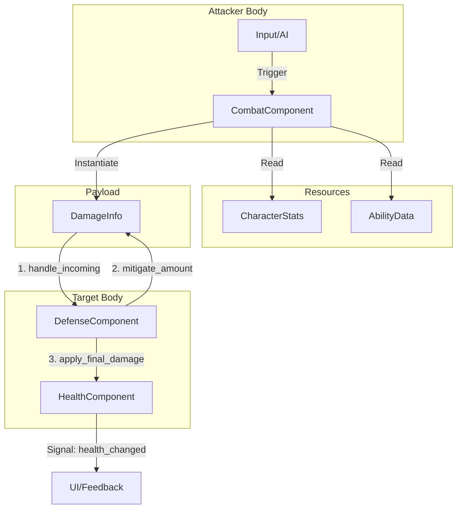

# Combat System Architecture

This document outlines the **SOLID, Component-Based, and Data-Driven** architecture for the combat system in *Guild of Highly Questionable Heroes*. This design is inspired by the multi-layered mitigation and stacking logic found in *Raiders of Blackveil*.

---

## 1. Core Philosophy

The system is split into three distinct layers to ensure that logic, data, and communication are strictly decoupled.

### **A. The DNA Layer (Resources)**
Pure data templates. These define "what" something is (e.g., a Warrior's stats, a Fireball's damage).
*   **`CharacterStats`**: Max HP, Base Power, Crit Chance.
*   **`AbilityResource`**: Multipliers, Cooldowns, VFX links.
*   **`StatusEffectResource`**: Ticking damage, Duration, Stack limits.

### **B. The Body Layer (Nodes/Components)**
Logic units attached to a `Character`. Each has a single responsibility.
*   **`HealthComponent`**: Manages current HP and death signals.
*   **`DefenseComponent`**: Intercepts damage to apply Barriers, Armor Plates, and Dodge.
*   **`CombatComponent`**: Handles offensive scaling (Stats + Ability) and triggers attacks.

### **C. The Messenger Layer (Payloads)**
Temporary objects that carry information between the Body Layer nodes.
*   **`DamageInfo`**: A `RefCounted` object containing raw damage, crits, attacker refs, and mitigation history.

---

## 2. The Combat Lifecycle

When an attack occurs, the information flows through the components like a nerve impulse:



---

## 3. The "Raiders" Logic: Interceptors & Mitigation

To replicate advanced mechanics like **Perks** and **Armor Plates**:

1.  **Interceptors (Perks):** Before the `DamageInfo` leaves the `CombatComponent`, a signal is emitted. A global `PerkManager` can intercept this object and modify its `final_amount` (e.g., +20% damage if "Fury" is active).
2.  **Layered Defense:** The `DefenseComponent` processes damage in a specific order:
    *   **Dodge Check:** Roll vs `DodgeChance`. If success, set damage to 0.
    *   **Barrier:** Subtract damage from temporary shield stacks.
    *   **Armor Plate:** If damage > 0, consume 1 plate to reduce damage by X%.
    *   **Protected HP:** Absorb remaining damage into the buffer bar.
    *   **Health:** Pass the remainder to the core HP pool.

---

## 4. Standardized Folder Structure

```text
res://
├── resources/
│   ├── stats/          # .tres files for Warrior, Slime, etc.
│   ├── abilities/      # .tres files for Slash, Heal, etc.
│   └── status_effects/ # .tres files for Bleed, Burn, etc.
├── scenes/
│   ├── components/     # Component scenes (Health, Defense, Combat)
│   └── actors/         # Combined actor scenes (Character + Components)
└── scripts/
    ├── core/           # damage_info.gd, enums.gd
    ├── components/     # health_component.gd, defense_component.gd, etc.
    └── systems/        # Global managers (perk_handler.gd)
```

---

## 5. Benefits for Solo Development

*   **Isolation:** A bug in Armor logic can only be in `defense_component.gd`.
*   **Expansion:** Adding a "Fire Inspector" perk only requires adding a listener to the `PerkManager` without touching the Character code.
*   **Iteration:** Tuning the game difficulty is done via `.tres` files in the Inspector, not by changing code.

---

## 6. Communication Strategy (Signals & DI)

To maintain **SOLID** principles, components never assume the existence of their siblings. They communicate upward to the parent (Character) or via a central "Messenger" payload.

### **A. Upward Communication (Signals)**
Components emit signals when something happens. They don't care who reacts.
*   **`CombatComponent`** emits `attack_triggered(ability_data)`.
*   **`WeaponHolder`** or an `AnimationPlayer` listens to this signal to play the appropriate visuals.
*   *Result:* You can swap a Melee Weapon for a Magic Wand without changing a single line of logic in the `CombatComponent`.

### **B. Downward Communication (Dependency Injection)**
The parent `Character` node acts as the **Orchestrator**. It holds references to its components and passes them to whoever needs them.
*   The `Character` script initialization:
    ```gdscript
    # character.gd
    func _ready():
        combat_component.init(stats_resource)
        defense_component.health = health_component
    ```

### **C. Cross-Body Communication (The Messenger)**
When Attacker A hits Target B, they only exchange a **`DamageInfo`** object.
*   The Attacker calls `target.defense_component.handle_incoming(payload)`.
*   The Attacker doesn't need to know if the target has HP, Armor, or if it's even a "Character" (it could be a breakable wall).

---

## 7. The Interceptor System (Perks & Modifiers)

To replicate the comedic and complex modifiers (e.g., *"Certified Fire Inspector"*), the architecture uses an **Interceptor Pattern**. This allows the `DamageInfo` payload to be modified as it travels through the pipeline.

### **A. Local Interceptors (The `PerkComponent`)**
Each character can have a `PerkComponent` that acts as a local filter.
1.  **Creation:** `CombatComponent` creates a `DamageInfo`.
2.  **Intercept:** Before sending, it passes the info to the `PerkComponent`.
3.  **Modify:** The `PerkComponent` loops through active perks and modifies the `DamageInfo.final_amount` or `DamageInfo.damage_type`.

### **B. Global Interceptors (The Event Bus)**
For world-wide effects (e.g., "All enemies deal double damage today"), a global `SignalBus` is used.
*   The `CombatComponent` emits `damage_ready_to_send(damage_info)`.
*   A `GlobalPerkManager` listens, checks world-state, and updates the `damage_info` object.

### **C. Defense Interceptors**
The `DefenseComponent` is itself a series of interceptors. Each defense layer (Barrier -> Armor -> HP) is an intercepting function that takes the `DamageInfo`, reduces its value, and passes it to the next layer.

### **Why this is powerful:**
*   **Decoupled Comedic Logic:** You can add a perk like *"Bureaucratic Delay"* (damage is dealt 2 seconds later) by simply creating a perk script that holds the `DamageInfo` in a timer, without modifying the `HealthComponent`.
*   **Easy Balancing:** All damage modification happens in one place (the interceptor loop) rather than being scattered across weapons, spells, and stats.

---

## 8. Code Principles & Best Practices

To ensure long-term maintainability for a solo developer, all contributors (human or AI) must adhere to these standards:

### **A. Strict Typing**
*   **Mandatory:** Use static typing for all variables, parameters, and return types.
*   **Why:** Catch errors at compile-time (Editor) rather than runtime.
*   *Example:* `func take_damage(info: DamageInfo) -> float:`

### **B. Code-Based Signals**
*   **Mandatory:** Connect signals via code in `_ready()` or `init()` functions.
*   **Avoid:** Connecting signals via the "Node" tab in the Editor.
*   **Why:** Makes the logic searchable via "Find in Files" and easier to refactor.

### **C. Strategic Singletons (Autoloads)**
*   **Principle:** Singletons are used for **Cross-Cutting Concerns** (Global Event Bus, Data Databases).
*   **Rule:** Components should never call "Global Managers" to change their own state; they emit signals to the managers or receive data from them.

### **D. Dependency Injection (DI)**
*   **Mandatory:** Use "Setter Injection" for component dependencies.
*   **Process:** The parent `Character` or `Spawner` is responsible for "handing" a component the references it needs.
*   **Why:** Prevents `get_parent().get_node(...)` spaghetti code. It makes components testable in isolation.
*   *Example:*
    ```gdscript
    # The parent orchestrates
    func _ready() -> void:
        health_component.died.connect(_on_died)
        defense_component.setup(health_component) # DI
    ```

### **E. Resource-First Data**
*   **Mandatory:** If a value can be tweaked for balance (speed, damage, cooldown), it belongs in a `Resource`, not hardcoded in a script.

### **F. Pragmatic Engineering**
*   **Principle:** Prioritize progress over perfect abstraction.
*   **YAGNI (You Ain't Gonna Need It):** Do not build complex systems (e.g., multi-layered pooling, advanced serialization) until the game actually requires them.
*   **Open-Closed Principle:** Design systems so they are **Open** for extension (via components/signals) but **Closed** for modification. If you have to rewrite a core orchestrator to add one feature, the abstraction has failed.
*   **Pragmatism:** If a single script slightly violates SRP but is not a bottleneck for development or performance, keep it. Ensure the structure *allows* for a split later without a total rewrite.

---

## 9. Naming Conventions

All GDScript code must follow the official [Godot GDScript style guide](https://docs.godotengine.org/en/stable/tutorials/scripting/gdscript/gdscript_styleguide.html).

| Construct | Convention | Example |
|---|---|---|
| Class | `PascalCase` | `class_name HealthComponent` |
| Variable (public) | `snake_case` | `var current_health: float` |
| Variable (private) | `_snake_case` | `var _cooldowns: Array[float]` |
| Function (public) | `snake_case` | `func apply_damage(...)` |
| Function (private) | `_snake_case` | `func _roll_damage(...)` |
| Parameter | `snake_case` | `func setup(character: Character)` |
| Constant | `SCREAMING_SNAKE_CASE` | `const MAX_STACKS = 5` |
| Signal | `snake_case` | `signal health_changed(...)` |
| Enum name | `PascalCase` | `enum DamageType` |
| Enum value | `SCREAMING_SNAKE_CASE` | `PHYSICAL, FIRE` |

### **Key Rules**
*   **No prefixes on parameters — except in constructors.** Use `p_name` in `_init()` only, to avoid shadowing class fields. Never use it in regular functions.
*   **`_` prefix = private.** Applies to fields and methods not meant to be accessed from outside the class.
*   **`_` on unused parameters only.** Prefix a parameter with `_` exclusively to suppress the "unused variable" warning (e.g. `_delta`). Do not use it on parameters that are actually used.
*   **Avoid shadowing Godot built-ins.** Never use `owner`, `name`, `position`, `rotation`, etc. as field or parameter names — they shadow `Node` properties and cause confusion. Prefer semantically precise names (e.g. `caster` instead of `owner`).
*   **Self-qualify shadowed fields.** When a parameter name matches a field name in `_init()` or `setup()`, use `self.field = field` rather than renaming either side.

---

## 10. Multiplayer Readiness (Future-Proofing)

While currently single-player, the architecture is designed to transition to Godot’s high-level multiplayer API without a total rewrite.

### **A. Authority Isolation**
*   **Logic vs. Visuals:** Components (Health, Defense) should only handle calculations. Visuals (Sprite3D, Animations) should listen to signals from these components.
*   **Networking Strategy:** In a future move, only the **Server** would own the `HealthComponent` and `DefenseComponent` logic. Clients would merely synchronize the resulting variables.

### **B. Payload Serialization**
*   **Constraint:** `RefCounted` objects like `DamageInfo` cannot be sent directly via RPC.
*   **Requirement:** All "Messenger" objects must include `to_dict()` and `from_dict()` methods to allow them to be sent as simple arrays or dictionaries over the network.

### **C. RPC Call-Sites**
*   The `AbilityComponent` is the designated entry point for ability execution. To add multiplayer, the initial trigger would be wrapped in a `.rpc()` call, moving the calculation from the local machine to the server.


